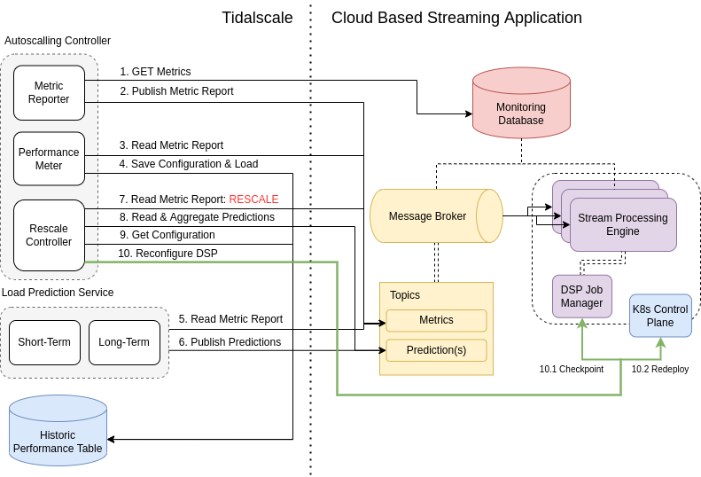

# TidalScale Predictive Autoscaler

> Predictive Autoscaler for cloud based Distributed Stream Processing Engines


## Quick Start

```
make all
```


## System Control Flow


<p align="center">
  
</p>

## Description

1. The Metric Reporter makes a series of API requests to the Prometheus time-series
database which itself is scraping the message broker, kubernetes API server, and
DSP jobmanager, these multiple metric values are stored locally, and these requests
are done every second.
2. The Metric Reporter takes the gathered matric values, labels, and publishes them
to the message broker in an individual topic titled ’metrics’
3. The Performance Meter reads the latest metric report from the message broker.
4. The Performance Meter decides from the state of the DSP’s performance whether
the current configuration is sufficient to handle the current traffic load, if yes, the
configuration and current load is saved to the Historic Performance Table, saved as
a key value of current configuration and current load. Only larger load values are
over written.
5. The Load Prediction Services, the short-term and long-term prediction models, each
read the metric report
6. The Load Predictoin Services each publish their predictions for the future load to
their own respective topics.
7. The Rescale Controller reads the metric report, it determines if any performance
thresholds are breached or if a proactive scaling may be necessary based on QoS
changes, if yes, a rescaling event is triggered.
8. The Rescale Controller has decided to rescale, first it will retrieve the future load
predictions from their respective topics, and will aggregate these predictions based
on the recent performance from each model.
9. The Rescale Controller will take this load expectation and request from the Historic
Performance Table a configuration that matches the future load expectation, it
will either linearly interpolate of extrapolate a configuration based on the available
information in the performance table.
10. Finally the Rescale Controller will deploy the new configuration by first creating a
save checkpoint for the DSP and then interacting with the kubernetes control plane
to re-deploy the DSP deployment with a new level of parallelism which equates to
more taskmanagers/pods.